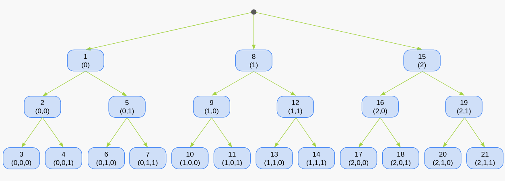
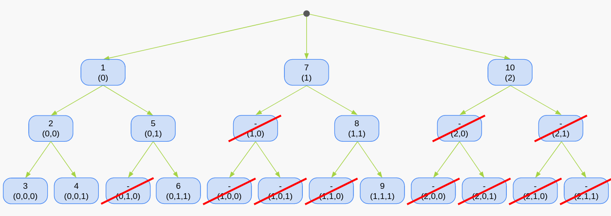
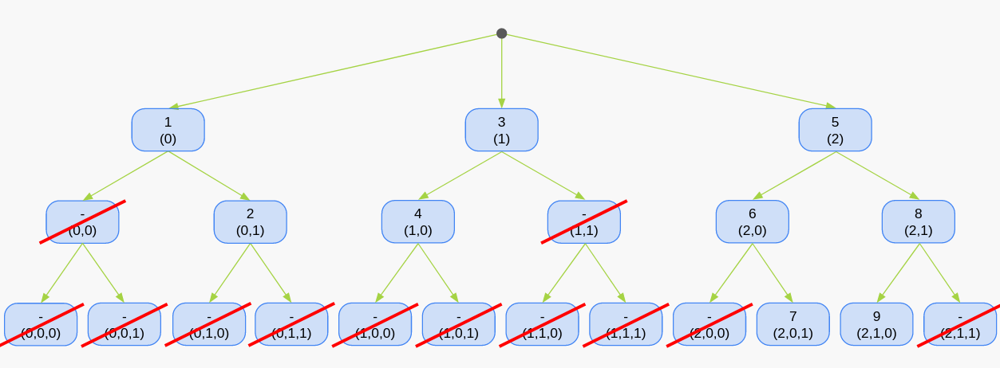
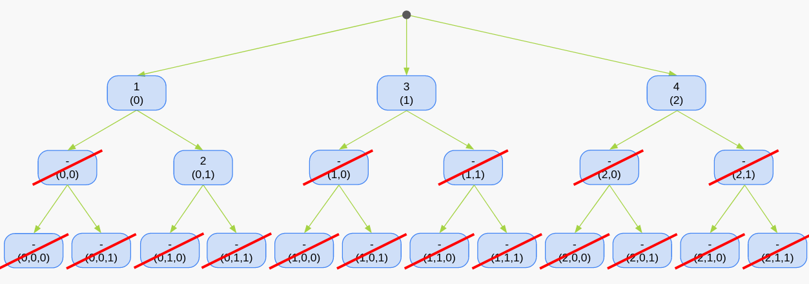

User guide
==========

General description
-------------------

A decision tree is a type of algorithm used in machine learning and data
analysis. It is a tree-like structure where each internal node represents a
feature or attribute, each branch represents a decision or rule, and each leaf
node represents an outcome.

Dectree allows you to generate large regular and irregular decision trees,
because the algorithm only generate the nodes when you need them. On a given
depth level of the tree, the regular decision tree have the same number of
possibilities for each node. This is not necessarily the case with irregular
decision trees.

The regular decision tree takes the number of possibilities at each depth
as input, whereas the irregular decision tree have no input but the user
need to set the number of possibilities as he goes down the decision tree.

Both trees have the same methods to explore the nodes : :code:`next_node`,
:code:`next_sorted_node`, :code:`next_unique_node`,
:code:`next_sorted_unique_node`. Each method is described below.
The exploration is based on a depth-first search,
going from the root node and exploring as far as possible along each branch
before backtracking. Here is a quick example of the nodes selected for
each exploration method. Each node displays the position in which it will be
explored, as well as its coordinates. Let's take for example a decision tree
with 3 choices at the first depth, then 2 choices for the second and third
depth.

Next node
^^^^^^^^^

All node will be explored as long as each node is set to
:code:`current_node_viability=True`.

  The order of selection of nodes for the :code:`next_node` method of depth-first
  searching. For this (3, 2, 2) decision tree, all nodes will be explored.

Next sorted node
^^^^^^^^^^^^^^^^

“Sorted” means that the node selected will only have an index value superior
or equal to the index value of the previous node. For example, if the actual
node is (0, 2, 4) the next depth has 5 possibilities, the next sorted node will
be (0, 2, 4, 4).

It can be used for solving problems where each level of the tree have the
same number of possibilities and where the order of a solution doesn't matter.
Thus, the nodes (0, 1, 2), (2, 0, 1) and (1, 2, 0) lead to the same solution.

  The order of selection of nodes for the :code:`next_sorted_node` method of
  depth-first searching. For this (3, 2, 2) decision tree, 11 nodes will not
  be explored.

Next unique node
^^^^^^^^^^^^^^^^

“Unique” means that the node selected will only have an index value different
from the index values of the previous node. For example, if the actual node
is (0, 2, 4) and the next depth has 5 possibilities, the next sorted node will
be (0, 2, 4, 1).

It can be used for urn-like problems where the balls are not placed back
once they are drawn.

  The order of selection of nodes for the :code:`next_unique_node` method of
  depth-first searching. For this (3, 2, 2) decision tree, 12 nodes will not
  be explored.

Next sorted unique node
^^^^^^^^^^^^^^^^^^^^^^^

“Sorted Unique” means that the node selected will only have an index value
strictly superior to the index values of the previous node. For example, if
the actual node is (0, 2, 3) and the next depth has 5 possibilities, the next
sorted node will be (0, 2, 3, 4).

It can be used for solving problems where each level of the tree have the same
number of possibilities, where the order of a solution doesn’t matter and
where once a node is drawn it can’t be drawn again.

  The order of selection of nodes for the :code:`next_sorted_unique_node` method of
  depth-first searching. For this (3, 2, 2) decision tree, only 4 nodes will
  be explored.

Regular decision tree
---------------------

For regular decision tree, the number of possibilities at each depth is
the unique input. It is a list of integers, where the first integer is the
number of possibilities for the first depth, and so on.

.. autoclass:: dectree.RegularDecisionTree
   :members:

Irregular decision tree
-----------------------

.. autoclass:: dectree.DecisionTree
   :members:

Q&A
---

No questions yet.
